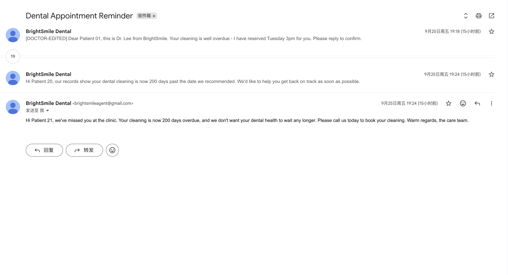
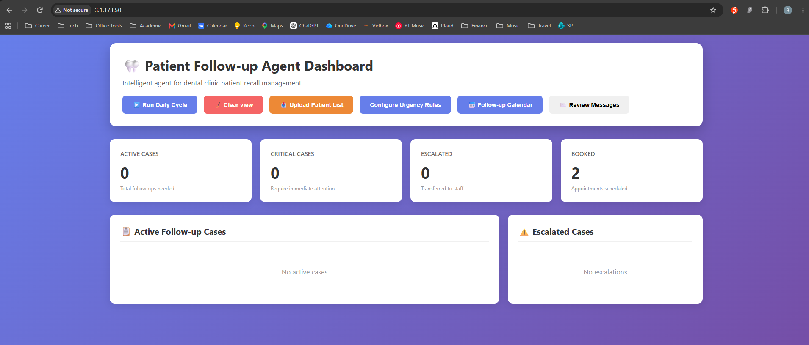

# Patient Follow-up Agent - Deployment Evidence

**Consolidated evidence pack — eight reports, their raw artifacts, and AWS Lightsail deployment progress**

| | |
| --- | --- |
| Prepared for | Clinic operations and IT decision-makers |
| Purpose | Deployment acceptance: what was measured, on which revision, and what remains unproven |
| Original evidence revision | `fbcc6c1ca09a7624fd5f01016e674cacdc4a5287` |
| Pack location | `proposal/evidence/` |
| Contents | 8 historical reports plus Lightsail deployment evidence; 2 available raw artifacts; 6 visual artifacts |
| Pack provenance | Reports 1–7 captured by script on 2026-09-25, 09:02–09:47 UTC; operator-supplied screenshots in sections 10 and 16 |
| Document date | 27 September 2026 |
| Rendering | Markdown and shared print stylesheet, rendered with Chromium |

---

## 1. How to read this pack

**27 September update.** Section 16 adds AWS Lightsail deployment progress from
the deployment conversation and operator record. Its provenance and remaining
LLM quota blocker are stated separately from the original captured reports.
The deployment evidence PDF includes this update and the public dashboard screenshot.

The first seven reports under `proposal/evidence/` were captured independently,
each by its own script, on 25 September 2026 between 09:02 and 09:47 UTC. Report 8
was contributed afterwards by the operator as a screen capture, which makes it an
operator-supplied artifact that no capture script can reproduce;
section 10 states what that costs. This document consolidates the eight: it
restates every figure, records the SHA-256 of each artifact as recomputed for this
PDF, and keeps the boundary between *measured* and *assumed* explicit.

Three kinds of claim appear in the pack, and they are not interchangeable. It
matters which one a figure belongs to when deciding whether the deployment is
ready.

| Claim class | Meaning | Evidenced by |
| --- | --- | --- |
| **Configuration** | The deployment is wired to named services with named identities | 2, 3 |
| **Behaviour** | The software did what it is specified to do, reproducibly | 1, 4, 5 |
| **Transmission** | A real message left the system and arrived somewhere | 6, 7, 8 |

Only class three is evidence about the outside world. Evidence 1 and 5 exercise
the agent's real code paths but with the offline printing delivery backend, so
they record decisions, not messages sent. Every report's "what this does *not*
claim" section states its own limit, and those limits are reproduced here rather
than smoothed over.

### The one-paragraph version

The agent runs its full loop, 811 tests pass on a pinned revision, the dashboard
and patient portal serve live data, and the AWS paths are wired to SES and End
User Messaging SMS. A real email was transmitted through the agent's own tool
layer, accepted by the provider, counted as delivered in the provider's
telemetry, and then found in the recipient's **spam** folder; three later reminders
were separately observed sitting in that same inbox (report 8). Placement is
therefore inconsistent rather than uniformly bad, which does not change the fix — a
clinic-owned, authenticated domain, warmed — only the odds of a reminder being seen
in the meantime. SES is still in the sandbox and the SMS channel is not subscribed.
For the original eight-report snapshot, the recorded delivery blockers are
account provisioning and sender reputation. The later Lightsail progress record
in section 16 also records a gateway token-quota blocker; successful model output
on that host remains unverified.

---

## 2. Evidence at a glance

| # | Report | What it establishes | Verdict |
| --- | --- | --- | --- |
| 1 | `01_agent_decision_audit.md` | 42 simulated days, 493 events, 463 decisions, 30 communication attempts over 11 patients | Recorded |
| 2 | `02_aws_messaging_config.md` | Transport pinned to named AWS services, region, sender identity and recipient allow-list | Configured |
| 3 | `03_runtime_and_repository.md` | The exact revision, interpreter, dependencies and codebase size every other claim rests on | Identified |
| 4 | `04_test_suite.md` | 811 tests pass, exit code 0, verbatim pytest output retained | Pass |
| 5 | `05_dashboard_runtime.md` | Application starts, serves dashboard and portal, answers its API, runs operator commands | Running |
| 6 | `06_live_delivery.md` | A real message was handed to the provider through the agent's tool layer and accepted | Sent |
| 7 | `07_delivery_confirmation.md` | Provider telemetry counted it delivered; the mailbox had filed it as spam | **Delivered to spam** |
| 8 | `08_patient_inbox_receipt.md` | Three later reminders from the same system seen in the recipient's inbox, per-patient bodies intact | **Delivered to inbox** (sample data) |

---

## 3. Evidence 1 — Agent decisions and audit trail

Captured 2026-09-25T09:02:41+00:00.

**Claim.** The agent runs its full Perceive → Decide → Act → Observe loop and
writes a durable, queryable audit trail for every decision and every delivery
attempt.

**Provenance.** The record is not hand-written. It is the output of the real
orchestrator driven by `proposal/scripts/generate_audit_record.py` over the
project's sample patients with the clock fixed, so the run does not depend on the
wall clock.

| Fact | Value |
| --- | --- |
| Snapshot analysed | `proposal/evidence/artifacts/audit_log_snapshot.json` (261,297 bytes) |
| Snapshot SHA-256 | `76551f7389296eda3ff1d905ec5ed8c486f98fccd12cff0db80e9cd9bff06644` |
| Events | 493 — 463 decisions, 30 communication attempts |
| Patients | 11 distinct identifiers |
| Simulated period | 2026-09-21 → 2026-11-01, 42 daily cycles |
| Delivery calls handled offline | 37 |

### Decisions

| Action | Count | Share |
| --- | ---: | ---: |
| `do_nothing` | 430 | 92.9% |
| `send_reminder` | 22 | 4.8% |
| `escalate_to_staff` | 11 | 2.4% |

| Urgency at decision time | Count | | Case status at decision time | Count |
| --- | ---: | --- | --- | ---: |
| critical | 209 | | escalated | 282 |
| high | 150 | | message_sent | 98 |
| medium | 78 | | booked | 39 |
| low | 26 | | declined | 32 |
| | | | pending | 11 |
| | | | awaiting_reply | 1 |

Escalation: 11 actions, 9 distinct patients ever escalated, 2.4% of decisions.
The high `do_nothing` share is the intended shape — the agent contacts a patient
on a schedule, not every cycle.

### Communication attempts

| Channel | Attempts | Succeeded | Failed | Rate |
| --- | ---: | ---: | ---: | ---: |
| email | 12 | 12 | 0 | 100.0% |
| sms | 9 | 9 | 0 | 100.0% |
| whatsapp | 7 | 7 | 0 | 100.0% |
| phone_call | 2 | 2 | 0 | 100.0% |
| **Total** | **30** | **30** | **0** | **100.0%** |

> **Reading the 100% rate.** Every attempt succeeded because the backend is the
> offline printer: it accepts any recipient and cannot fail. The rate describes
> the offline backend, **not** carrier deliverability, and is not comparable to
> the fallback-path behaviour in the proposal's robustness section. Carrier-level
> delivery is evidenced only by reports 6 and 7.

### The Observe path

Five patient replies were injected so the record covers inbound handling, not
only outbound decision-making.

| Day | Patient | Reply | Status before | Status after |
| --- | --- | --- | --- | --- |
| 2026-09-23 | P006 | Yes, I'd like to schedule an appointment | message_sent | booked |
| 2026-09-30 | P007 | No thanks, not needed right now | message_sent | declined |
| 2026-10-07 | P004 | How much will this cost with my insurance? | escalated | escalated |
| 2026-10-14 | P003 | Can I come in next week? | escalated | awaiting_reply |
| 2026-10-21 | P011 | Yes please | — | no_case |

Final case statuses across the 11 cases: **escalated 9, declined 1, booked 1**.

> **The finding that matters here.** Nine of eleven cases end in `escalated`, and
> by design the agent then stops touching them — clinical ambiguity belongs to a
> human. But the case is not re-raised if the alert is missed. This is correct
> behaviour with an operational consequence that belongs in the rollout plan, not
> a defect to be silently patched.

**Generator guard.** Every constructed channel had to be a
`PrintDeliveryBackend`, and the transmitting backend's `deliver()` was patched to
raise. That assertion is what makes this a record of decisions instead of
transmission. The sample patients carry invented addresses, so the run must not
transmit.

**Data hygiene.** `audit_log.json` is append-only and the automated test suite
writes to it, so the live file grows every time the tests run. The figures above
come from the frozen snapshot, and re-running the tests will not reproduce
identical totals from the live file.

---

## 4. Evidence 2 — AWS messaging configuration

Captured 2026-09-25T09:30:27+00:00.

**Claim.** The messaging transport is wired to named AWS services in a named
region, sends from verified identities, and refuses recipients outside an
explicit allow-list.

| Setting | Value |
| --- | --- |
| `AWS_REGION` | `ap-southeast-1` |
| `AWS_SES_SOURCE` | `brightsmileagent@gmail.com` |
| `AWS_SES_CONFIGURATION_SET` | `patient-followup` |
| `AWS_SMS_ORIGINATION_IDENTITY` | `+6585144321` |
| `AWS_SMS_ALLOWED_NUMBERS` | `+6583536885` |
| `AWS_EMAIL_ALLOWED_ADDRESSES` | `martinchenonly1@gmail.com`, `rgjh1996@gmail.com` |
| `MESSAGING_DRY_RUN` | `0` |
| `AGENT_LIVE_SENDS` | *(empty — live sends disabled by default)* |

Read back from the live account: session authenticated as
`arn:aws:iam::621236283593:root`; SES sending enabled `True`; 24-hour quota
`200.0`, max send rate `1.0/s`, sent in the last 24 hours `3.0`. Three verified
SES identities (`brightsmileagent@gmail.com`, `martinchenonly1@gmail.com`,
`rgjh1996@gmail.com`). Verified SMS destination numbers: **not readable** —
`SubscriptionRequiredException` from `DescribeVerifiedDestinationNumbers`.

> A quota of 200 per 24 hours at 1/s is the SES **sandbox** ceiling, not a
> production limit. Production access and SMS origination onboarding are
> prerequisites for a real patient population and are outstanding.

> The SMS read failure means this account is not subscribed to End User Messaging
> SMS in the queried region. The SMS code path is complete, but attempts return
> `not_subscribed` until the service is provisioned. **Do not describe SMS as
> available on the strength of this pack.**

Delivery code paths in the captured revision, cited by file and line:

| File | Symbol | Line |
| --- | --- | ---: |
| `tools/aws_providers.py` | `client.send_text_message` | 307 |
| `tools/aws_providers.py` | `client.send_email` | 348 |
| `tools/messaging.py` | `def send_sms` | 449 |
| `tools/messaging.py` | `def send_email` | 482 |
| `agent/delivery.py` | `def is_configured_for_live_sends` | 334 |

---

## 5. Evidence 3 — Runtime and repository state

Captured 2026-09-25T09:47:34+00:00.

**Claim.** The deployment was validated against a specific, identifiable revision
on a specific interpreter with specific library versions, so a reviewer can
confirm they are comparing like with like before judging anything else.

> **Snapshot scope.** This capture describes commit `fbcc6c1` only. It is **not**
> a description of the current `master`, which is a later revision. Re-run
> `proposal/scripts/capture_runtime_evidence.py` to re-capture against a later
> revision.

| Fact | Value |
| --- | --- |
| Python | 3.14.5 (CPython) |
| Executable | `/Users/martinchen/agent_followship_v3/.venv/bin/python` |
| Platform | `macOS-27.0-arm64-arm-64bit-Mach-O` |
| Branch | `master` |
| Commit | `fbcc6c1ca09a7624fd5f01016e674cacdc4a5287` |
| Commit subject | Merge pull request #3 from pioneer6-ai/feature/patient-portal |
| Commit date | 2026-09-25T13:41:07+08:00 |
| Working tree clean | no — 5 files modified (this analysis work only) |
| Remote | `git@github.com:pioneer6-ai/agent_followship_v2.git` |

Installed dependencies at capture time: boto3 1.35.36, botocore 1.35.99,
flask 3.0.0, openpyxl 3.1.2, certifi 2026.7.22, **anthropic not installed**.

Codebase size — 78 files, 32,073 lines:

| Module | Files | Lines |
| --- | ---: | ---: |
| `tests/` | 30 | 12,119 |
| `tools/` (messaging, AWS, LLM, transport) | 13 | 6,118 |
| `agent/` (orchestrator, decision, delivery, audit) | 9 | 4,635 |
| `web/` (dashboard, portal, APIs) | 5 | 3,477 |
| `core/` (models, clock, policy, scheduling) | 11 | 1,978 |
| `scheduling/` | 4 | 1,321 |
| `utils/` | 2 | 1,022 |
| root (`app`, `demo`) | 2 | 1,115 |
| `scripts/` | 2 | 288 |
| **Total** | **78** | **32,073** |

> **Path caveat, stated by the pack itself.** The interpreter recorded here lives
> in the sibling clone `agent_followship_v3`, because that is where the virtualenv
> that produced the capture sits. The clone this PDF ships in
> (`agent_followship_v2`) has no `.venv`, and its installed dependency set is the
> one listed in section 12 rather than the list above. The evidence is valid for
> the recorded revision and the recorded interpreter; it is not a claim about the
> virtualenv in this directory.

---

## 6. Evidence 4 — Automated test suite

Captured 2026-09-25T09:47:34+00:00.

**Claim.** The revision identified in evidence 3 passes its full automated suite
on the recorded interpreter. The suite is the executable form of the behaviour
contracts: tool schemas, error taxonomy, provider selection, agent loop control
flow, delivery gating and the web API.

> **Snapshot scope.** The result below (`811 passed`) is the suite as it stood at
> commit `fbcc6c1` only. It is **not** the current count on `master`.

| Fact | Value |
| --- | --- |
| Status | **PASS** (exit code 0) |
| Command | `/Users/martinchen/agent_followship_v3/.venv/bin/python -m pytest tests -q` |
| Passed / Failed / Errors / Skipped | 811 / 0 / 0 / 0 |
| Warnings | 16 |
| Duration | 14.43 s |
| Verbatim output | `proposal/evidence/artifacts/pytest_output.txt` |
| Summary line | `811 passed, 16 warnings in 14.43s` |

The inventory counts test **functions** — 681 across 29 modules, 11,915 lines of
test code. pytest reports 811 passing **cases** because several are
parameterised and expand at collection time. Both numbers describe one suite.

The heaviest modules by test count: `test_llm_providers.py` (79),
`test_aws_tools.py` (73), `test_hospital_setup.py` (64),
`test_agent_delivery.py` (50), `test_providers.py` (48),
`test_agent_loop.py` (39), `test_patient_portal.py` (31),
`test_tool_contract.py` (29).

> **Known limitation, found while capturing this evidence.** The suite exercises
> the real orchestrator and therefore its real audit logger, which appends to
> `audit_log.json` in the working directory. Running the tests mutates the audit
> record. Evidence 1 is computed from a frozen snapshot for exactly this reason,
> and isolating the audit path during tests is a prerequisite for production
> sign-off.

---

## 7. Evidence 5 — Running dashboard and patient portal

Captured 2026-09-25T09:06:57+00:00.

**Claim.** The deployed application starts, serves its staff dashboard and its
patient portal, answers its JSON API and accepts operator commands. The
screenshots are the UI as a browser receives it; the JSON files are the unedited
API responses the dashboard consumes while rendering.

| Fact | Value |
| --- | --- |
| Server | `http://127.0.0.1:54301` (werkzeug, bound to localhost) |
| Dashboard screenshot | 475,711 bytes, viewport 1600×1400 |
| Patient portal screenshot | 736,923 bytes |
| Portal URL | `/patient/QITt-c7mJE6WhJtNDUIjdVGqpQPPrnJs` (token scoped to one patient) |

The page was not captured idle. Before the screenshot, the same endpoints the
dashboard's buttons call were invoked, so the board shows cases this process
produced:

- `POST /api/run-cycle` → `success=True`, `cases_processed=11`
- `POST /api/simulate-reply` P001 *"Yes, I'd like to schedule an appointment"* → `message_sent` → `awaiting_reply`
- `POST /api/simulate-reply` P007 *"No thanks, not needed right now"* → `message_sent` → `declined`
- `POST /api/simulate-reply` P004 *"How much will this cost with my insurance?"* → `message_sent` → `escalated`

The running board, 11 cases in five states, urgency critical 3 / high 2 /
medium 3 / low 3:


The patient portal, rendered from a token minted by the running application
rather than mocked up:


`GET /api/status`:

```json
{
  "audit_summary": {
    "successful_bookings": 0,
    "total_communications": 17,
    "total_decisions": 12,
    "total_log_entries": 29
  },
  "cases_by_status": {
    "awaiting_reply": 1, "booked": 0, "declined": 1, "escalated": 1,
    "message_sent": 8, "opted_out": 0, "pending": 0,
    "pending_future_availability": 0
  },
  "cases_by_urgency": { "critical": 3, "high": 2, "low": 3, "medium": 3 },
  "escalated_cases": 1,
  "last_updated": "2026-09-25T17:06:55.280205",
  "total_active_cases": 11,
  "total_patients": 12
}
```

`GET /api/cases` returned 11 cases; first entry:

```json
{
  "conversation_length": 6,
  "days_overdue": 69,
  "last_contacted": "2026-09-25",
  "last_visit": "2026-06-27",
  "patient_id": "P001",
  "patient_name": "Sarah Johnson",
  "preferred_channel": "sms",
  "reminder_count": 1,
  "status": "awaiting_reply",
  "treatment_type": "post_surgery",
  "urgency": "critical"
}
```

> The board is populated with the project's built-in sample data, not real
> patients. It demonstrates the operator experience and the operating surface; it
> is not a record of live patient activity.

> **Audit isolation.** This run wrote its audit log to a temporary directory
> (`followup-dashboard-*/audit_log.json`) and discarded it, so exercising the
> agent here cannot alter the audit trail evidence 1 is computed from. The two
> captures were deliberately separated for this reason.

---

## 8. Evidence 6 — Live end-to-end delivery

Captured 2026-09-25T09:30:36+00:00, revision `fbcc6c1ca09a7624fd5f01016e674cacdc4a5287`.

**Claim.** A message was handed to the real provider through the agent's own tool
layer and the provider answered. This is one of only two artifacts in the pack
that evidences transmission rather than behaviour, which is why it refuses to run
without explicit approval.

| Fact | Value |
| --- | --- |
| Tool | `send_email` |
| Channel | email |
| Recipient | `martinchenonly1@gmail.com` |
| Sender identity | `brightsmileagent@gmail.com` |
| Reason recorded | "pilot acceptance check: verifying the delivery path end to end" |
| Latency | 228 ms |
| `simulated` | `false` |

Provider response:

```json
{
  "status": "sent",
  "channel": "email",
  "recipient": "martinchenonly1@gmail.com",
  "data": { "reason": "pilot acceptance check: verifying the delivery path end to end" },
  "message_id": "010e01a0d7e70489-3cadc714-db2a-4219-9174-efc749f3ae5f-000000"
}
```

The toolkit's own audit trail for the same run records the tool, channel,
recipient, status, message id, null error fields, latency, reason and body
preview — the same fields production relies on, emitted by the same code path.

> **Acceptance is not delivery.** The provider returning `sent` means SES accepted
> the message for transmission. For email, the authoritative record of arrival is
> the `Delivery` event emitted by the `patient-followup` configuration set, which
> is what evidence 7 reads.

---

## 9. Evidence 7 — Delivery confirmation

Captured 2026-09-25T09:47:34+00:00.

**Claim.** What happened to the message after the provider accepted it, from two
independent vantage points: the provider's own delivery telemetry and the
recipient's mailbox. These are different claims and are kept separate on purpose.

Message under test: id `010e01a0d7e70489-3cadc714-db2a-4219-9174-efc749f3ae5f-000000`,
recipient `martinchenonly1@gmail.com`, sent 2026-09-25T09:30:36+00:00.

### Check 1 — provider delivery telemetry

CloudWatch `AWS/SES` for configuration set `patient-followup`, namespace queried
in `ap-southeast-1`:

| Metric | Sum |
| --- | ---: |
| Delivery | 6 |
| Bounce | 0 |
| Complaint | 0 |

No bounce and no complaint across the window is a genuine positive: the sending
identity is not being rejected or abused-flagged.

### Check 2 — recipient mailbox

Read-only IMAP search of `imap.gmail.com` for subject fragment
"delivery confirmation":

| Folder | Messages found |
| --- | ---: |
| INBOX | 0 |
| spam | 5 |
| all_mail | 0 |

**The message was found in: spam.**

> **This is the most consequential operational finding in the pack.** The mailbox
> accepted the message and filed it as spam. A reminder that lands in a spam
> folder has not reminded anyone, and no amount of agent correctness compensates
> for it. This is a sending-identity and reputation problem, not a software
> problem: it is fixed by moving to a clinic-owned domain with SPF, DKIM and DMARC
> configured, and by warming that domain.

Observed headers (three of the five messages found):

```
Subject: Patient Follow-up Agent - delivery confirmation
From: brightsmileagent@gmail.com
Date: Fri, 25 Sep 2026 09:30:36 +0000
Message-ID: <010e01a0d7e70489-3cadc714-db2a-4219-9174-efc749f3ae5f-000000@ap-southeast-1.amazonses.com>
```

```
Subject: Patient Follow-up Agent - delivery confirmation
From: brightsmileagent@gmail.com
Date: Fri, 25 Sep 2026 09:30:27 +0000
Message-ID: <010e01a0d7e6e250-35534990-542e-4545-8385-16806cc2153c-000000@ap-southeast-1.amazonses.com>
```

```
Subject: Patient Follow-up Agent - delivery confirmation
From: brightsmileagent@gmail.com
Date: Fri, 25 Sep 2026 09:30:11 +0000
Message-ID: <010e01a0d7e6a32e-de7255b4-a647-42f4-8e67-7c915e659186-000000@ap-southeast-1.amazonses.com>
```

---

## 10. Evidence 8 — Patient inbox receipt

Contributed 2026-09-26T10:36+08:00 by the operator as a screen capture.

**Claim.** Reminders written by the agent and sent through the configured SES
identity reached the recipient's **inbox**, rendered as ordinary mail from
"BrightSmile Dental", with the per-patient generated wording intact. This is a third
vantage point on delivery alongside the provider telemetry and the IMAP search in
evidence 7, and it disagrees with evidence 7 on where the mail was filed.



| | |
| --- | --- |
| File | `proposal/evidence/screenshots/patient_inbox_received.png` |
| Size | 365,876 bytes |
| Dimensions | 2,840 x 1,538, 8-bit RGBA PNG |
| SHA-256 | `6302c9b8941f048ede4c527671513d48be1188bfa469c5c5e0e4bd94ea70a2c9` |
| Thread header | `9月25日周五 19:18–19:24 (15小时前)` — Friday 25 September, 19:18 to 19:24, "15 hours ago" |

Three messages in one thread, every sender line reading "BrightSmile Dental". The
first two are collapsed to their opening line, the third is expanded:

| Order | Opening line as displayed | Addressed to |
| --- | --- | --- |
| 1 | `[DOCTOR-EDITED] Dear Patient 01, this is Dr. Lee from BrightSmile. Your cleaning is well overdue - I have reserved Tuesday 3pm for you. Please reply to confirm.` | Patient 01 |
| 2 | `Hi Patient 20, our records show your dental cleaning is now 200 days past the date we recommended. We'd like to help you get back on track as soon as possible.` | Patient 20 |
| 3 | `Hi Patient 21, we've missed you at the clinic. Your cleaning is now 200 days overdue, and we don't want your dental health to wait any longer. Please call us today to book your cleaning. Warm regards, the care team.` | Patient 21 |

The three bodies differ in greeting, phrasing and closing. These are not one template
with a substituted name, and none of those sentences appears in any template in the
repository.

### What corroborates it

**The proposal already documents this batch.** Section 9.4 records the trial: a model
configured for decisioning and message authoring, run against a cohort of 21 patients
all scored `critical`, a staff edit honoured, then "Confirm Selected" reporting
`21 sent, 0 failed, queue empty`. Section 10 is the recipient-side view of that same
event — the console and the mailbox, one batch.

**The run's audit log puts the same messages in the same window.** The log for that
deployment (the sibling clone's append-only `audit_log.json`, which section 9.4
explains is deliberately kept out of the pack) contains:

| Timestamp (+08:00) | Patient | Channel | Success | Preview |
| --- | --- | --- | --- | --- |
| 2026-09-25T19:18:10 | CRIT001 | email | true | `[DOCTOR-EDITED] Dear Patient 01, this is Dr. Lee from BrightSmile. Your cleaning is well overdue - I…` |
| 2026-09-25T19:23:03 | CRIT001 | email | true | `[DOCTOR-EDITED] Dear Patient 01, this is Dr. Lee from BrightSmile. Your cleaning is well overdue - I…` |
| 2026-09-25T19:24:06 | CRIT020 | email | true | `Hi Patient 20, our records show your dental cleaning is now 200 days past the date we reco…` |
| 2026-09-25T19:24:08 | CRIT021 | email | true | `Hi Patient 21, we've missed you at the clinic. Your cleaning is now 200 days overdue, and…` |

The first row is a single send of the edited draft; the batch is 21 sends to
`CRIT001`–`CRIT021` between 19:23:03 and 19:24:08, all `channel=email`, all
`direction=outbound`, all `success=true`, which is section 9.4's `21 sent, 0 failed`.
Two details identify the log as that run rather than a similar one: it carries exactly
the 11 `llm-error` and 1 `llm-guardrail` entries section 9.4 quotes, and its
`Decided by: llm` count has grown from the 944 section 9.4 records to 1,600 — an
append-only record still being written to, which is the reason it stays out of the
pack. A reviewer can therefore check this section's arithmetic against
`test_data/demo_21_critical_patients.csv` and the proposal, but not against a file
this pack ships, and report 8 says so.

Two further cross-checks, both recomputable from files in this repository:

- `CRIT001`, `CRIT020` and `CRIT021` are the ID column of
  `test_data/demo_21_critical_patients.csv`: 21 rows named `Patient 01` to
  `Patient 21`, every one carrying `martinchenonly1@gmail.com` — one of the two
  addresses in the `AWS_EMAIL_ALLOWED_ADDRESSES` allow-list of evidence 2. That is
  why three patients share one mailbox and one thread.
- The "200 days" in the body is not decorative. Those rows record a last visit of
  2026-02-23 and a recall window of 14 days, so the cleaning fell due on 2026-03-09;
  on 25 September 2026 that is exactly 200 days overdue.

### What it does not prove

> This is an operator-supplied artifact that no capture script produced. No one can
> re-run it, and the hash above pins the bytes this pack ships, not the provenance of
> the screen it records.

- **That the doctor-edited marker is generated.** `[DOCTOR-EDITED]` appears nowhere
  in the repository; a case-insensitive search of the revision returns no source
  file. It is text the operator typed into the draft body, carried through the
  draft-edit path (`update_pending_send` / `edited_by` in `agent/orchestrator.py`,
  reached from `web/app.py`), not a label the software emits.
- **That any real patient was contacted.** The recipients are the sample list.
- **That the message arrived for the other 18 patients, or anywhere else.** One
  mailbox, one provider, three of 21 messages shown: an existence proof of inbox
  placement, not a placement rate.
- **That a delivered reminder is a read reminder.** An inbox is not an open, a reply
  or a booking.
- **That evidence 7 was wrong.** Evidence 7's read-only IMAP search found its own
  subject fragment in spam. Both observations hold: different messages, different
  times, and placement for a new sending identity on a free mailbox provider is
  exactly the sort of thing that varies. The domain and reputation work stays
  necessary; this artifact does not reduce it.
- **That the capture sits inside the pack's own capture window.** 19:18–19:24
  +08:00 is 11:18–11:24 UTC, whereas every scripted capture ran between 09:02 and
  09:47 UTC that day. It is a later event observed after the fact, not a re-render.

---

## 11. Artifact integrity — historical hash record

The table below retains the hash record from the earlier document build.
It is not a new verification of every artifact for the 27 September PDF.
`artifacts/audit_log.generation.json` is listed historically but is absent from
the current repository; its recorded hash cannot be verified from this checkout.
The new Lightsail screenshot is recorded separately in section 16.6.

The pack's value rests on artifacts being the same bytes the reports were written
from. Full SHA-256, with the size
recorded in `00_index.md` beside the size on disk. One row is marked
hand-contributed: its hash pins the bytes this pack ships, but no capture script
produced it, so there is nothing for a reviewer to re-run. Rows carrying a
parenthetical are annotated, and the annotations are explained in the two
subsections below.

| Artifact | Size on disk | SHA-256 | Matches index |
| --- | ---: | --- | --- |
| `00_index.md` | 6,336 | `f379280504ec6be465faddc50bacc022a680e24dfb9c0923945f52f0755de685` | n/a (is the index) |
| `01_agent_decision_audit.md` | 5,155 | `1b9c73463a6718c18e0373640ef64cc77a918d383295a1c5b460fbca3f573f41` | yes |
| `01_agent_decision_audit.json` | 7,494 | `0b8a5e4f937ea33bde3de754cbc7c00eb878e65bc4d4e79dc790b5f16829df26` | yes |
| `02_aws_messaging_config.md` | 2,302 | `9ac617c9c42042064923702cc6dad2c7887f46e81431d4f38505dbc918b5db7d` | yes (corrected — see below) |
| `02_aws_messaging_config.json` | 2,578 | `2a803512f062039d2ca2a7d23e466ec20006c78db642ace8dc827fb83652d438` | yes (corrected — see below) |
| `03_runtime_and_repository.md` | 1,788 | `f7de4397ab358fde7f00f17e735a9540e258a05751843b4f1335b405e23de4f5` | yes (was stale — see below) |
| `03_runtime_and_repository.json` | 1,504 | `ca48f2eabe4e1e1ea7c2d986d7f309f62ec60f8374992863ce29803c1d952f7c` | yes |
| `04_test_suite.md` | 3,228 | `a53602b82f2e15354317ec7298f7427947a6d3fcc5dd5911342f46e713308af6` | yes (was stale — see below) |
| `04_test_suite.json` | 5,735 | `ebd31f7de4488db0bc90ce71cbb235c60347dc93cd6ff48a3bbc89c689fd60f0` | yes |
| `05_dashboard_runtime.md` | 3,368 | `9a800d1e377ede06f2f538091a763c46822b3e98a4f1b37b3b8daadfbe3d9a52` | yes |
| `05_dashboard_runtime.json` | 3,500 | `514cd666c7756048e66f47be9bcad618a6c93f7f2bcec882ab717031d5024a9f` | yes |
| `06_live_delivery.md` | 2,092 | `ba29e0695c1cc155a25e605f7cd89d0d6dc77191d4c38604e9d5f108e24e4553` | yes |
| `06_live_delivery.json` | 1,558 | `3594bd2a00f08b3de827dbe5155ae91b1ada47876ff982c04fa2d54c2a1e177e` | yes |
| `07_delivery_confirmation.md` | 2,589 | `5f9b34db0ca43398bee5596d990de0985a0c86153783a74421c6f6e8b277d629` | yes |
| `07_delivery_confirmation.json` | 2,425 | `46f441dee5b38dde1c6179df54f1dfb97eaa2adaef4564a83da3d3b652287fe4` | yes |
| `08_patient_inbox_receipt.md` | 8,863 | `6ff287cbeead04c5491f5004822d24409f8080bfc14b145fdd0e046d3e47d0a5` | yes |
| `08_patient_inbox_receipt.json` | 6,417 | `533ee2685524faa161371bfc7f80c322df91a0ef9d2f4bb48ecb087af5a75c24` | yes |
| `artifacts/audit_log_snapshot.json` | 261,297 | `76551f7389296eda3ff1d905ec5ed8c486f98fccd12cff0db80e9cd9bff06644` | yes |
| `artifacts/audit_log.generation.json` | 4,782 | `42da6d67abc3fdad5415daab3e377b2b44c9c3531acad79079b20df89eb59243` | yes |
| `artifacts/pytest_output.txt` | 2,216 | `1da74e80729d72a81aeb2561d0504b1ee665df426d930122ac12dfb41feeeff6` | yes |
| `screenshots/dashboard_cases_api.json` | 3,824 | `393bcba9f050eb10236fdde27ce9dcf8658ef16ef96df26e29f1a0fbc3a6e3da` | yes |
| `screenshots/dashboard_overview.png` | 475,711 | `3c4e06f485f6bf9d95226442f8c71957674596d287a2ea7612e50c603ffc5e7a` | yes |
| `screenshots/dashboard_status_api.json` | 569 | `acb61130deebd2a46f6c3d05620cecf205514c4dcbb67fc315511d9448e3534a` | yes |
| `screenshots/patient_inbox_received.png` | 365,876 | `6302c9b8941f048ede4c527671513d48be1188bfa469c5c5e0e4bd94ea70a2c9` | yes (hand-contributed; section 10) |
| `screenshots/patient_portal.png` | 736,923 | `b919902b944a98d3cc730abafc2248ea60f991bce62c82bbdac700dfcd486b20` | yes |

### Historical index corrections and operator-supplied evidence

`00_index.md` records hashes and sizes for every report. In the revision this pack
was first built from, entries 3 and 4 did not match their files. That is exactly the
failure mode a hash exists to catch, so it was reported rather than quietly fixed,
and it is recorded here for the same reason — as a note on how the pack was
maintained, not as an open item. It is now closed:

- Commit `0735515` ("docs: point project references at agent_followship_v2 and
  stamp evidence snapshots") added a *snapshot scope* note to `03_…md` and
  `04_…md` and repointed the recorded interpreter from this clone's absent
  `.venv` to `agent_followship_v3/.venv`. The commit body states plainly that
  verbatim captured output was deliberately left untouched.
- The commit did **not** re-run `proposal/scripts/capture_evidence_index.py`, so
  the index carried the pre-edit sizes and hashes for those two files.
- The *numbers* in reports 3 and 4 were never in question: they still trace to
  their JSON sidecars and to `artifacts/pytest_output.txt`. Only the index's
  byte-for-byte attestation of the two prose files was wrong.
- Re-running the index capture against the pack as it stands in this revision
  resolves it: all eight reports and every supporting artifact now match their
  indexed size and hash. The index also gained the hand-contributed entry for
  report 8's image, and its preamble now states that an artifact may be contributed
  by hand rather than captured, because leaving the old wording in place would have
  claimed a script for that image that does not exist.

Two consequences of report 8 remain, and they are properties of the artifact rather
than of the index. Its hash is verifiable; its provenance is not — nothing in the
pack can show that the image is a screen of the mailbox it says it is. And the
index's attestation for it is only as good as the file the operator supplied.

### One locator in report 2 pointed at the wrong line

Report 2's "Delivery code paths" table cites `tools/messaging.py` twice. Those two
rows originally read 383 and 413, which are the lines of `send_sms_message` and
`send_email_message` — the transport helpers — rather than the `send_sms` and
`send_email` entry points the rows name. `capture_aws_config_evidence.py` resolved
each locator with a bare substring search, and `def send_sms` occurs inside
`def send_sms_message`, so the first hit won. The locators were right; only the
line numbers were wrong.

The resolver now matches on word boundaries, and re-running it over this revision
yields 307, 348, 449, 482 and 334 — the values report 2 now shows. Those two
numbers were corrected in `02_aws_messaging_config.md` and in its JSON sidecar
directly, rather than by re-running the capture: the remainder of that report is
live account state, and re-capturing it would have substituted whatever the
account returns today for the observations the report makes. The index was
regenerated afterwards, so the hashes pinned above attest to the corrected files.

### Reviewing this pack, in order

1. Confirm the revision on the first page matches the build under review.
2. Check `artifacts/pytest_output.txt` against the hash in section 11 — that is
   the one artifact carrying verbatim program output.
3. Re-derive the evidence 1 counts from `audit_log_snapshot.json` rather than
   reading the tables in section 3.
4. Read section 13 before accepting the "reading the 100% rate" qualification in
   section 3 as a caveat rather than a defect.
5. Treat section 10 as the weakest link in the chain of custody: it is the only
   claim here whose source process a reviewer cannot repeat.

---

## 12. Independent re-run on the current revision

The reports above are pinned to `fbcc6c1`. The revision used for this historical re-run was
`c39c91f` (`master`, 2026-09-26), 21 commits later, and the pack's own
snapshot-scope notes ask a reader to re-capture rather than extrapolate. Those
commits are not documentation only: they include the move of all LLM configuration
into `.env` and an `httpx` pin that repairs the OpenAI client, so **the line
citations elsewhere in this pack describe `fbcc6c1`, and some of them address code
that has since moved.** The
suite was re-run here, on this clone, to see whether the pass result survives the
later revision and a different interpreter. It does:

| Fact | Evidence 4 (`fbcc6c1`) | This re-run (`c39c91f`) |
| --- | --- | --- |
| Passed | 811 | **952** |
| Skipped | 0 | 1 |
| Failed / Errors | 0 / 0 | 0 / 0 |
| Interpreter | CPython 3.14.5 (sibling clone `.venv`) | CPython 3.13.15 (conda env `agent_hackathon`) |
| Duration | 14.43 s | 12.26 s |

The suite grew by 141 cases between the two revisions, which follows from the
commits in between (the LLM message-authoring port, the `.env` configuration
refactor and the docs work). The one
skip is deliberate and reported by pytest as a skip, not a failure.

Two honest qualifications. First, this re-run used the conda environment
`agent_hackathon`, whose dependency set is the `requirements.txt` pin list —
flask 3.0.0, werkzeug 3.0.1, openai 1.51.0, httpx 0.27.2, anthropic 1.8.0,
boto3 1.35.36, botocore 1.35.99, openpyxl 3.1.2, pytest 7.4.3. It is *not* the
interpreter that produced evidence 4. Second, running the suite exercises the real
audit logger, so this run appended to the working tree's `audit_log.json` — the
same limitation evidence 4 records. It cannot affect evidence 1, which is computed
from the frozen snapshot.

Nothing here is a substitute for evidence 4: it is a corroboration at a later
revision, on a different interpreter, and it should be read that way.

---

## 13. What the pack proves, and what it does not

**Proven.**

- The agent runs its full loop and produces a durable audit trail: 493 events over
  a 42-day simulated period (evidence 1).
- The revision, interpreter, dependency pins and codebase size are identified
  precisely enough that another party can reproduce the comparison (evidence 3).
- The full suite passes at that revision, exit code 0, with verbatim output
  retained (evidence 4), and it still passes one revision later on a different
  interpreter (section 12).
- The application starts, serves the dashboard, the patient portal and the JSON
  API, and executes operator commands against its own running process
  (evidence 5).
- SES accepted a message produced by the agent's own tool layer and returned a
  message id (evidence 6); the provider's telemetry counted deliveries with zero
  bounces and zero complaints (evidence 7).
- Reminders from this system can land in an inbox and render as ordinary mail from
  the configured sender, with per-patient generated wording and a figure that
  recomputes from the sample data (evidence 8). Existence, not rate.

**Not proven, and not to be inferred from the above.**

- **Inbox delivery as a property.** The delivery-confirmation message was filed as
  spam (evidence 7) while three later reminders were observed in the inbox
  (evidence 8), from one mailbox and one provider. Placement is inconsistent, so no
  reminder can be assumed to have been seen. Until sending moves to a clinic-owned
  domain with SPF, DKIM and DMARC, this stays a coin toss that happens to have
  landed well twice.
- **Real patient transmission.** Evidence 1's 100% success rate is a property of
  the offline printing backend; evidence 5 runs on built-in sample data.
- **SMS.** The channel is code-complete but the account is not subscribed;
  attempts return `not_subscribed` (evidence 2).
- **Production throughput.** The recorded quota is the SES sandbox ceiling of
  200 per 24 h at 1/s (evidence 2).
- **The model-backed decision path as a pinned artifact.** The pack's decision
  counts come from the rule engine because the evidence harness pins it, not
  because a model was unavailable. The deployment is wired for a model; the pack
  contains no hash-identified artifact for that path.
- **Alert re-raise after escalation.** Nine of eleven cases end escalated and are
  then left alone by design (evidence 1). That is correct behaviour with an
  operational gap behind it if a staff alert is missed.
- **Readership.** Evidence 8 shows three reminders in an inbox. It does not show an
  open, a reply or a booking, and no patient behaviour is evidenced anywhere in the
  pack.
- **Provenance of report 8's image.** Its bytes are pinned by hash; that it is a
  screen of the mailbox it depicts is the operator's word, and the report says so
  itself (section 11).

---

## 14. Open items this pack hands to provisioning

These provisioning, engineering and operational items remain outstanding.
Section 16 adds the Lightsail gateway quota blocker and pending model validation:

| # | Item | Evidence | Blocking for |
| --- | --- | --- | --- |
| 1 | Move SES out of the sandbox: request production access | 2 | Any population larger than verified test recipients |
| 2 | Send from a clinic-owned domain with SPF, DKIM, DMARC; warm it | 7, 8 | Reminders reaching an inbox consistently rather than sometimes |
| 3 | Subscribe End User Messaging SMS and onboard an origination identity | 2 | The SMS channel, and therefore the fallback path |
| 4 | Isolate the audit path during tests | 4 | Production sign-off; currently tests mutate the live audit record |
| 5 | Decide the escalation re-raise policy — re-alert after N hours, or accept the gap | 1 | Whether a missed staff alert has a safety net |
| 6 | Decide how a hand-contributed artifact is attested — accept the operator's provenance, or require a capture that a script can repeat | 10, 11 | Whether any future screenshot can be treated as more than an existence proof |
| 7 | Pin the model-backed decision path to its own hash-identified artifact | proposal §7.2 | Any claim about model-driven decisions |

---

## 15. Reproducing this pack

Every report is regenerated by one command, from the project root, in an
environment with the project's dependencies installed:

```bash
python proposal/scripts/generate_audit_record.py                          # regenerate audit_log.json
python proposal/scripts/capture_audit_evidence.py                         # evidence 1
python proposal/scripts/capture_aws_config_evidence.py                    # evidence 2
python proposal/scripts/capture_runtime_evidence.py                       # evidence 3
python proposal/scripts/capture_tests_evidence.py                         # evidence 4
python proposal/scripts/capture_dashboard_screenshot.py                   # evidence 5
python proposal/scripts/capture_live_send.py --channel email --approve    # evidence 6
python proposal/scripts/capture_delivery_confirmation.py                  # evidence 7
python proposal/scripts/capture_evidence_index.py                         # index
python proposal/scripts/build_deployment_evidence_pdf.py                  # this document
```

Evidence 6 transmits to a real mailbox and therefore refuses to run without
`--approve`; every other capture script is read-only with respect to the outside
world. Evidence 1 depends on the generator in the first line, because the audit
log is appended to rather than recomputed.

Report 8 has no command in that list and cannot have one: its image is a screen
capture contributed by the operator, so there is nothing to re-run. The pack's
hand-contributed artifacts are declared in `proposal/scripts/capture_evidence_index.py`
(`HAND_CONTRIBUTED`) precisely so the generated index keeps saying so.

Three prerequisites apply. Evidences 2, 6 and 7 read live AWS state, so the shell
must hold valid credentials for the account. Evidences 5 and 7 drive a local
browser and an IMAP client respectively (headless Chrome, and the mailbox
credentials from `SMTP_USERNAME` / `SMTP_PASSWORD` in `.env`). Evidence 5 should
be re-captured in a scratch directory so its agent run cannot append to the audit
trail evidence 1 is derived from.

Each capture writes both a human-readable report and the machine-readable facts
behind it, plus the raw artifact where one exists, so a reviewer can recompute
any figure in this document instead of trusting it. `00_index.md` records the
SHA-256 of every artifact at the moment the index was generated.

This PDF itself is generated, not assembled by hand: it is
`proposal/deployment_evidence.md` rendered through the same pandoc → headless
Chrome pipeline as the proposal, with the shared print stylesheet in
`proposal/assets/proposal.css`. Re-running the build renders the Markdown content; PDF bytes can vary by
renderer and build metadata. The script checks the result rather than assuming
success — it checks the PDF magic bytes, rejects a suspiciously small file, and
reports the page count.

---

## 16. AWS Lightsail deployment — from server setup to a running public dashboard

Updated 27 September 2026 using the
[Deploy To AWS Cloud conversation](https://chatgpt.com/c/6ab776d1-3dc4-83ec-b7cb-a7c7cdf57048),
the operator's deployment record and the public dashboard screenshot supplied
with this update.

**Deployment outcome.** The Patient Follow-up Agent was deployed to an Ubuntu
server on AWS Lightsail in Singapore and opened successfully in a browser at
`http://3.1.173.50`. The supplied screenshot shows the application's dashboard
rendered at that public IP, including its controls and case counters. Together
with the recorded Gunicorn startup and successful `/api/status` check, this
documents the program running on the deployed server. Claude integration was a
subsequent validation step and remained blocked by gateway token quota.

### 16.1 Provision the Lightsail server and public address

The deployment began with an Ubuntu Lightsail instance in Singapore
(`ap-southeast-1`), sized at **4 GB RAM, 2 vCPU and 80 GB SSD**. A static IP was
configured so the application could be reached at a stable public address.
The final browser evidence below shows `3.1.173.50` in the address bar.

### 16.2 Prepare Ubuntu and install the application

Git, Python **3.12.3** and Nginx were installed on the server. The
`pioneer6-ai/agent_followship_v2` repository was cloned, a Python virtual
environment was created, and the project dependencies were installed into it.
Application configuration and safety settings were placed in `.env`.

These steps provided the application code, isolated Python runtime and server
configuration required to launch the program. The retrieved debugging exchange
also confirms that the operator was working inside the project directory with
the virtual environment active. Exact shell commands, safety-setting values and
the deployed commit were not retained in the retrieved record, so they are not
reconstructed here. Credentials are excluded from this evidence pack.

### 16.3 Run the program with Gunicorn and systemd

Gunicorn served the Python application on the local address
`127.0.0.1:8080`. The `patient-agent` systemd service managed the application
process. After a restart, the conversation recorded this startup output:

```text
Started patient-agent.service
Starting gunicorn 26.2.0
Listening at: http://127.0.0.1:8080
Using worker: sync
Booting worker
```

This is the recorded server-side evidence that the service started, Gunicorn
bound to the application port and a worker booted. The deployment record also
reports a successful `/api/status` response, establishing that the application
answered its status API. The raw Lightsail JSON response is not attached here;
section 7's earlier localhost JSON belongs to a different capture.

### 16.4 Publish the application through Nginx

Nginx was configured as the reverse proxy for the Gunicorn application. Public
browser requests reached Nginx on the Lightsail host and were forwarded to the
application listening on `127.0.0.1:8080`:

```text
Browser: http://3.1.173.50
          |
          v
AWS Lightsail Ubuntu server (Singapore, ap-southeast-1)
          |
          v
Nginx reverse proxy
          |
          v
Gunicorn: 127.0.0.1:8080
          |
          v
Patient Follow-up Agent application

Process manager: systemd service patient-agent
```

### 16.5 Evidence: the deployed program opens at the public IP

The operator supplied the following browser screenshot. It shows the Patient
Follow-up Agent Dashboard loaded at `3.1.173.50`:



| Visible evidence | Observation |
| --- | --- |
| Browser address | `3.1.173.50`; browser labels the connection "Not secure" |
| Application identity | **Patient Follow-up Agent Dashboard**, with the dental clinic patient recall subtitle |
| Application controls | Run Daily Cycle, Clear view, Upload Patient List, Configure Urgency Rules, Follow-up Calendar and Review Messages |
| Dashboard counters | Active cases **0**, critical cases **0**, escalated **0**, booked **2** |
| Case panels | "No active cases" and "No escalations" |

**What this demonstrates.** The public endpoint served the application's
dashboard and the browser rendered its interface and displayed state. The
deployment reached a visible, working application page. The booked counter is
the value displayed by that page; it is not independent proof of two real
patient bookings. This screenshot does not demonstrate that each control was
exercised or that Claude produced a decision.

### 16.6 Evidence provenance

| Evidence | Source and scope |
| --- | --- |
| Instance specification, installation, `.env`, static IP and Nginx setup | Operator's account of the deployment steps in the continuation request |
| Service startup | Output transcribed in the retrieved deployment conversation |
| `/api/status` success | Operator's deployment record and the conversation handoff; raw response not retained here |
| Public dashboard | Operator-supplied screenshot embedded above; original capture time not supplied |
| Screenshot file | `proposal/evidence/screenshots/lightsail_public_dashboard.png` |
| File size | 325,214 bytes |
| SHA-256 | `66a556ba2f556d70f356e95aa1465431fe05784e430ae268da0a165dac977b72` |

The screenshot is preserved as supplied. Its hash identifies the committed
image bytes; it does not independently authenticate the server or capture time.
This section adds evidence from the deployment session to the original eight
reports. It does not change their historical hashes, test counts or runtime
snapshots. The new image is recorded here and is not included in the older
`00_index.md` snapshot. No fresh server probe or test-suite run was performed
for this documentation update.

### 16.7 Subsequent validation: Claude gateway quota blocker

With the application deployed, the next step was to validate its LLM connection.
The following debugging record concerns that integration; the public dashboard
and service startup above establish the application deployment outcome.

##### Bedrock gateway configuration and authentication debugging

The chat used the application's OpenAI-compatible adapter to target the hackathon
Bedrock gateway with this configuration. The key below is a placeholder only:

```env
AGENT_LLM_PROVIDER=openai-compatible
AGENT_LLM_MODEL=global.anthropic.claude-sonnet-4-5-20250929-v1:0
AGENT_LLM_BASE_URL=https://api.softwaresystems.app/v1
AGENT_LLM_API_KEY=
AGENT_LLM_EXTRA_HEADERS={"X-API-Key":"REDACTED"}
```

| Step | Observation recorded in the chat | Interpretation |
| --- | --- | --- |
| Initial request | HTTP 401 `invalid gateway api key` | Gateway authentication was failing |
| Header inspection | `dict_keys([])` | The adapter had no parsed extra header |
| JSON diagnosis | Opening double quote before `X-API-Key` was missing; malformed JSON was parsed as an empty header mapping | Correct JSON quoting was required |
| Corrected shell export | `dict_keys(['X-API-Key'])` | The adapter successfully loaded the header name without printing its secret value |
| Model probe | A request through `create_llm_client()` targeted the Claude Sonnet 4.5 model above with `max_tokens=50` and the prompt `Reply with exactly BEDROCK_OK` | A direct gateway/model probe was attempted |
| Final response | HTTP 429 `Token quota exceeded` | The chat recorded authentication as successful and the remaining blocker as the team's gateway token quota |

The request reached the gateway for the configured Claude Sonnet 4.5 target.
The transition from an authentication rejection to the quota response supports
the chat's conclusion that authentication was resolved. **It does not prove
that Bedrock executed the model or that Claude returned generated text.**
`BEDROCK_OK` was the requested success marker, not an observed successful output.

The successful header inspection followed a shell export. The chat then
instructed the operator to persist the corrected JSON in `.env` and restart
`patient-agent`; completion of that final persistence/restart step is not shown.
The earlier successful service startup therefore does not establish that the
running service inherited the subsequently corrected header.

##### Rules fallback and remaining validation

The conversation describes `LlmDecisionEngine` catching provider failures and
falling back to `RuleDecisionEngine`, with decisions still passing through
Policy Guard before action:

```text
PERCEIVE → DECIDE → LLM provider error → RuleDecisionEngine → Policy Guard → ACT
```

The chat explicitly cautions that patient messages in startup logs do not prove
Claude generated them, because deterministic fallback can produce application
activity. This is the fallback behavior described in the conversation; the final
direct model probe is not itself a captured agent cycle demonstrating fallback
for that specific 429. No successful Lightsail `source=llm` decision or
hash-identified fallback trace is added by this section.

Outstanding validation from the chat:

1. Restore or increase the team's gateway token quota through the organisers.
2. Confirm the corrected header JSON is saved privately in `.env` and loaded by
   the restarted `patient-agent` service, inspecting header names only.
3. After quota is available, run one direct probe and record whether
   `BEDROCK_OK` is actually returned.
4. Run an agent cycle under the configured safety settings and retain a redacted
   decision record establishing `source=llm`, or the actual error/fallback result.

These are pending checks, not completed evidence. The earlier messaging limits
and open items in section 14 remain in scope. No actual gateway API key is
included in this write-up.
