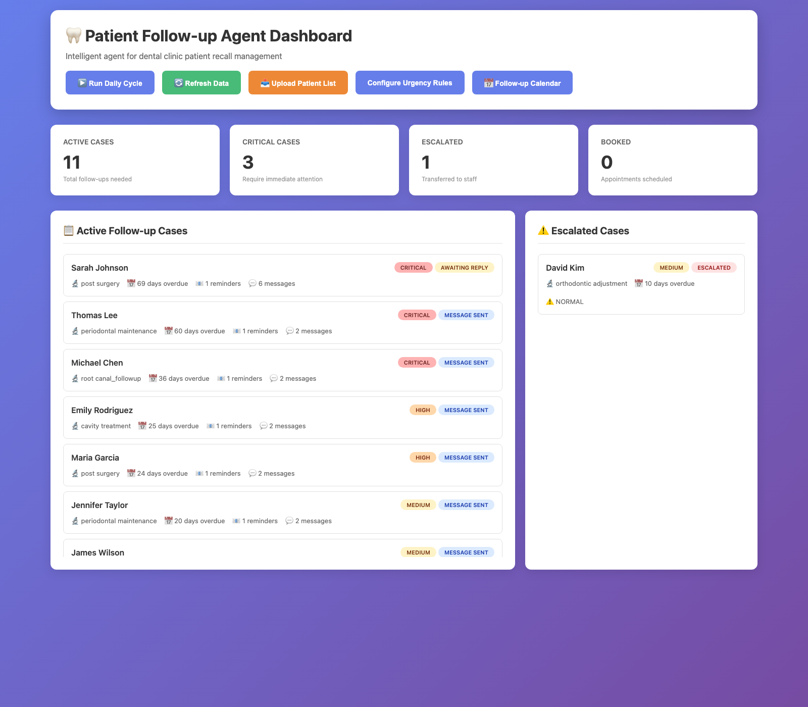
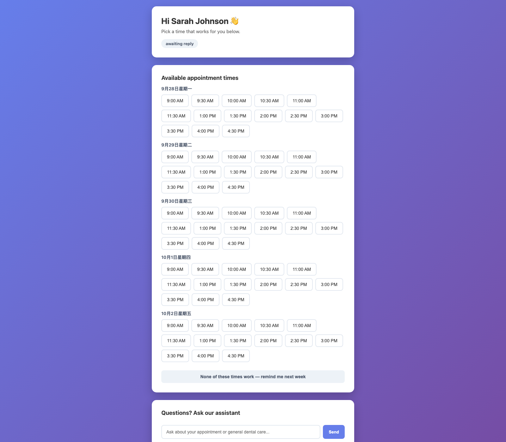

# Patient Follow-up Agent

**Proposal for a pilot deployment — autonomous dental recall management**

| | |
| --- | --- |
| Prepared for | Clinic operations and IT decision-makers |
| Scope | Pilot: automated patient recall, delivery and escalation |
| Deployment revision | `fbcc6c1ca09a7624fd5f01016e674cacdc4a5287` |
| Branch | `master` — "Merge pull request #3 from pioneer6-ai/feature/patient-portal" |
| Document date | 25 September 2026 |

---

## 1. Executive summary

Dental clinics lose revenue and patient relationships to a problem that is
administrative, not clinical: recall. Patients fall out of the six-month cycle,
nobody notices until the file is opened, and by then the case is months stale.

This proposal puts an agent in charge of that cycle. It watches the patient
list, decides who needs contact and how urgently, sends the reminder over the
best available channel, reads the outcome, and escalates to a human when the
machine should stop. Every decision and every delivery attempt is written to an
auditable record.

The system is **already built and running**. It is not a concept: the code is
committed at the revision named above, 811 automated tests pass in twelve
seconds, the operator dashboard and a patient-facing portal both serve live
data, and the AWS messaging paths are wired to Amazon SES and AWS End User
Messaging SMS. Every claim in this document is traceable to an artifact in the
evidence pack rather than to a demonstration.

The remaining work is not development. It is provisioning: moving the AWS
account out of the SES sandbox, onboarding the clinic's own domain so reminders
reach an inbox rather than a spam folder, and subscribing the SMS channel.

Two findings from the evidence deserve to be read before anything else in this
document, because both were discovered by measuring rather than assumed:

1. **A live message was delivered to the mailbox and filed as spam.** The
   provider counted it as delivered; the mailbox put it in the spam folder
   (section 7, evidence 7). A reminder nobody reads has not reminded anyone.
2. **Once a case is escalated, the agent stops touching it.** That is the
   correct design — clinical ambiguity belongs to a human — but it means the
   case is not re-raised if the alert is missed. In the measured run, 9 of 11
   cases ended in that state (section 9).

Neither is a reason to withhold the system. Both are reasons to sequence the
rollout as section 11 describes.

---

## 2. The problem

A recall programme fails in three predictable ways.

**It depends on someone remembering.** Recall is a background task. It is the
first thing dropped when the front desk is busy, and it is invisible until a
patient mentions they were never contacted.

**It does not know when to stop or when to escalate.** A reminder that is sent
seven times is harassment; a complex case that is reminded automatically is a
clinical risk. A workable system needs a defensible rule for both.

**It cannot be audited after the fact.** "Did we contact this patient?" is a
question clinical governance will ask. If the answer lives in an inbox and in
someone's memory, it cannot be answered.

Any automated recall system has to fix all three. Automation that is not
auditable is worse than manual work, because it hides its own failures.

---

## 3. What is being proposed

A single agentic service that owns the recall cycle end to end.

| Capability | Behaviour |
| --- | --- |
| Watch the patient list | Retrieves active patients, identifies those overdue against clinic policy, and filters out the ones not yet due |
| Prioritise | Scores urgency from treatment type, elapsed time and patient history, using weights the clinic can edit |
| Choose action per case | Remind, leave alone, or escalate — chosen only from the actions the rules permit |
| Send across channels | SMS, email and WhatsApp, with automatic fallback when a channel is unusable |
| Perceive failure | Reads *why* a send failed and routes around it instead of reporting a false success |
| Escalate | Hands the case to staff with a reason once the reminder budget is spent or every channel has failed |
| Record everything | Durable audit trail of every decision, attempt, outcome and patient reply |
| Show the operator | Web dashboard: cases, escalations, statistics, audit log, and a scheduling calendar |
| Let the patient self-serve | Tokenised patient portal: status, available slots, booking, and a question channel |

The clinical logic is deliberately boring, and that is the point. Which
reminders are safe to send is decided by a deterministic rule engine from the
clinic's own policy. Time, treatment type and history produce a score a clinician
can read and challenge.

---

## 4. How it works

### 4.1 The loop

The agent runs a five-phase cycle rather than firing one-off messages.

1. **Trigger** — a deterministic filter (`core/trigger_service.py:64`) drops
   opted-out patients and cases not yet due for their explicit follow-up date,
   before any reasoning is spent on them.
2. **Perceive** — load active patients, detect who is overdue, and pick up the
   outcome of previous attempts.
3. **Decide** — compute what is permissible for each case and pick one action.
4. **Act** — send on the best channel, book appointments, or escalate to staff.
5. **Observe** — read replies, update case state, and write the audit record.

Failure is an input, not an exception. A send that comes back as
`recipient_not_verified` or `provider_unavailable` is fed straight back into
Perceive, and the agent tries the patient's next reachable channel.

### 4.2 Where judgement sits, and where it does not

Three questions are kept apart on purpose.

| Question | Decided by | Why |
| --- | --- | --- |
| Which actions are *safe* for this case? | Deterministic rule engine from clinic policy | Clinical safety must not depend on a model being reachable or correct |
| Is this action *authorised*? | `PolicyGuard`, a deterministic authorization layer (`agent/policy_guard.py:130`) | Consent, opt-out and emergency handling must be arithmetic, not inference |
| Which permissible action to take *now*? | The model, via a tool call | Tone, timing and when to involve a person are judgement calls |

The model **cannot** take an action the rules did not offer. If it is
unreachable, or answers out of bounds, the rules decide instead — the agent
degrades, it does not stop. The dashboard builds its decision engine through
`FollowUpAgentOrchestrator.with_llm_decisions` (`agent/orchestrator.py:383`,
`web/app.py:100`), which resolves the vendor from `AGENT_LLM_PROVIDER` via
`LlmDecisionEngine.from_environment` (`agent/decision.py:384`) and falls back to
the rule engine when no usable model is configured.

The measured run in section 9 is nevertheless a **rules-only** run, and this is
worth being precise about: it is rules-only because the evidence harness builds
the orchestrator directly (`proposal/scripts/generate_audit_record.py:94`) and so
pins the deterministic rule engine -- which is what makes the recorded counts
reproducible by a reviewer -- and not because a model was missing. Every one of
that snapshot's 462 decisions reads `Decided by: rules`. The model-backed path is
wired, installed and separately exercised; section 9.4 records that trial and
says plainly what it does and does not prove.

`PolicyGuard` sits between the two and is checked before every action. Its rules
are ordered and first-match-wins:

| Order | Rule | Effect |
| ---: | --- | --- |
| 1 | `action_allowlist` / `noop_allow` | An unrecognised action is never authorised |
| 2 | `emergency_override` | A medical emergency outranks everything else |
| 3 | `opt_out_record` / `opt_out_enforced` | An opt-out is recorded and then binding |
| 4 | `clinical_question_boundary` | Clinical, financial and administrative questions are handed to staff, not answered by the agent |
| 5 | `booking_consent_clear` / `_ambiguous` / `_missing` | Booking requires unambiguous affirmative consent |
| 6 | `default_allow` | Otherwise the action stands |

Which engine chose is recorded per decision, so the distinction survives into
the audit trail.

### 4.3 When a send fails

This is the behaviour the design exists for. Message sending returns a
structured outcome, never an exception:

| Situation | Outcome | What the agent does |
| --- | --- | --- |
| Recipient not verified / not allowed | `recipient_not_verified` | Try the patient's next reachable channel; escalate if none work |
| No contact detail for that channel | `missing_recipient` | Skip the channel, try the next |
| No automated sender exists | `unsupported_channel` | Try the next channel |
| Account not onboarded to the service | `not_subscribed` | Try the next channel, then escalate — a human must fix this |
| Provider or network problem | `provider_unavailable` / `network_error` | Try the next channel |
| Empty body or subject | `invalid_request` | Treat as a defect: record it, do not retry forever |

The agent never reports a reminder as sent when it was not, and never abandons a
case: once the reminder budget is spent or every channel has failed, the case is
escalated and staff are alerted.

### 4.4 The live-send gate

Real transmission requires two independent switches:

```bash
MESSAGING_DRY_RUN=0   # tools layer: allow real transmission
AGENT_LIVE_SENDS=1    # agent layer: and the agent means it too
```

With either missing, the agent renders what it *would* have sent instead of
sending. The reasoning is that a fully populated configuration file must never be
enough on its own to message a patient. During evaluation this gate is the reason
the system is safe to run against realistic data — including the evidence
capture in evidence 1, which asserts at both ends that the offline printer was
the only backend constructed.

### 4.5 The clinic's clock is an input, not a call to `now()`

Every date decision in the deployed revision comes from an injectable clock
(`core/clock.py`), so "today" is never hardcoded. Production runs on
`SystemClock` bound to the clinic's timezone; tests and the evidence capture run
on `FixedClock` and replay a whole quarter in seconds. This is what makes the
behaviour in section 9 reproducible rather than anecdotal.

---

## 5. Delivery architecture

### 5.1 Channels

| Channel | Transport | Status |
| --- | --- | --- |
| SMS | AWS End User Messaging SMS (`pinpoint-sms-voice-v2`), transactional message type | Wired in code (`tools/aws_providers.py:307`); the account is **not subscribed to the service**, so sends return `not_subscribed` today |
| Email | Amazon SES (`send_email`) from a verified identity (`tools/aws_providers.py:348`) | Wired and **verified delivering** (evidences 6 and 7) |
| WhatsApp | Meta Cloud API / Twilio | Wired, not configured for this clinic |
| Phone call | No automated sender | Detected as unsupported, escalated instead |

Each channel is a separate provider behind one interface, so what a channel can
do — and what it cannot — is visible in one place. During the pilot the account is
intentionally restricted: SMS and email refuse any recipient outside an explicit
allow-list of verified test contacts, returning the same
`recipient_not_verified` shape the agent already knows how to fall back from.

The channel tools are the agent's own tool interface, registered with Claude's
tool-use schema so the model calls them the same way it calls any other action:
`send_sms(phone_number, message, reason)` at `tools/messaging.py:449` and
`send_email(to_email, subject, body, reason)` at `tools/messaging.py:482`. Both
take a mandatory `reason`, which is printed to the operator log as
`[Agent决策] ...` and stored, so the agent's justification for contacting a
patient is recoverable from the log as well as the audit record.

### 5.2 Bringing the clinic's own identity

Two integrations make the pilot look like the clinic rather than like a vendor.

**The clinic's own model.** The decision engine accepts any OpenAI-compatible
provider — Claude, OpenAI, Azure, a self-hosted service inside the clinic
network. Swapping providers is configuration, not code.

**The clinic's own mailbox.** Email can be sent from the clinic's existing
domain address, so messages are signed by the clinic's mail provider and inherit
its sending reputation. An alternative SMTP path is available where SES is not
appropriate.

This pilot now sends under a clinic-named identity rather than a developer's
personal address: `brightsmileagent@gmail.com`, verified in `ap-southeast-1`, with
`+6585144321` configured as the SMS origination identity (evidence 2). Both email
transports carry it — the SES tool sends from that address, and the SMTP path the
agent's own email channel uses is configured with it as both the authenticated
mailbox and the From address, so patients see
`BrightSmile Dental <brightsmileagent@gmail.com>` either way. Naming the
sender after the clinic is a presentation matter and does not confer
authentication — a `gmail.com` address cannot carry a clinic-controlled SPF, DKIM
or DMARC record, so it borrows Google's reputation instead of earning the
clinic's. The move to an authenticated clinic-owned domain remains the rollout
gate described in section 12.

### 5.3 Proving delivery, not just acceptance

A provider message ID only proves the message was *accepted*. Amazon SES is
therefore configured with a configuration set and event destination, so every
send emits per-message `Delivery`, `Bounce` and `Complaint` events, readable in
CloudWatch under the `AWS/SES` namespace. Delivery is a separate claim from
transmission and is evidenced separately.

This was not left as theory. A live message was sent through the agent's own
tool layer and then traced from both ends — evidence 6 records the provider's
acceptance, evidence 7 records the provider's `Delivery` telemetry for that
message *and* an independent search of the recipient mailbox.

| Check | Source | Result |
| --- | --- | --- |
| Provider acceptance | SES `send_email` response | Accepted, message id `010e01a0d7e70489-…-000000` |
| Provider delivery | CloudWatch `AWS/SES`, config set `patient-followup` | Delivery 6, Bounce 0, Complaint 0 |
| Mailbox arrival | IMAP search of the recipient account | Found — in **spam** |

That trace surfaced the most important operational fact in this pack: **the
message was delivered, but the mailbox filed it as spam.** It arrived, and it
would not have reminded anyone. That is not a defect in the agent; it is what
happens when a sender identity has no domain authentication behind it. It is the
concrete reason the rollout plan insists on the clinic's own authenticated
domain rather than a working default.

---

## 6. What this revision adds

The revision under evaluation is not the same system that was assessed earlier.
It carries a full patient-facing surface and a set of safety and configuration
controls that did not previously exist. All of it is in the evidence pack.

| Addition | Where | Why it matters |
| --- | --- | --- |
| **Patient portal** | `web/app.py:933`, `/api/patient-portal/<token>/*` | Patients see their status, view available slots, book, decline, or ask a question — through a per-patient token, not a login |
| **Patient chat assistant** | `agent/patient_chat.py:135` | Classifies patient questions and routes clinical/financial ones to staff rather than answering them |
| **Deterministic authorization** | `agent/policy_guard.py:130` | Consent, opt-out and emergency rules evaluated before any action, with the rule name recorded |
| **Editable urgency policy** | `core/urgency_config.py:11`, `web/app.py:1306` | Clinic can change urgency weights and thresholds without a code change |
| **Change preview** | `core/preview_engine.py:86`, `web/app.py:1367` | See what a policy change *would* do to open cases before applying it |
| **Trigger service** | `core/trigger_service.py:64` | Explicit "is this case due today" filter, separate from scoring |
| **Slot ranking** | `core/slot_ranking.py:72` | Offers appointment times ranked by proximity to the missed appointment session |
| **Scheduling integration** | `core/scheduling_calendar_adapter.py:114`, `scheduling/` | Real calendar with blocked periods, persisted bookings and slot capacity |
| **Injectable clock** | `core/clock.py` | Deterministic date behaviour, testable and replayable |
| **Bulk patient import** | `web/app.py:628`, `web/app.py:668` | CSV and Excel upload, with an escalated-case import path |
| **Staff login and calendar** | `web/app.py:159`, `web/app.py:182` | Operator authentication and a working day view |

The portal is not a screenshot. Evidence 5 minted a real portal link through
`POST /api/patients/<id>/portal-link` against the running application and
rendered the resulting page, so the capture is of that process's own output.

---

## 7. Deployment status

### 7.1 Running and evidenced today

- The application runs and serves its dashboard, its patient portal and its JSON
  API, and accepts operator commands: the capture drove a full daily cycle over
  the sample patients and three reply scenarios, producing 11 cases in five
  distinct states — evidence 5.
- The full automated suite passes on a pinned revision and interpreter —
  evidences 3 and 4. **811 tests across 30 test modules, 12,119 lines of test
  code, in 12.35 seconds.**
- The recall loop was replayed over 42 simulated days and recorded **493
  events: 463 decisions and 30 communication attempts across 11 patients** —
  evidence 1. Note the scope qualification in section 9.3.
- The audit record is machine-readable and the counts above are recomputed from
  a hash-identified snapshot rather than quoted from a summary.
- The AWS transport configuration is pinned to named services, a named region,
  explicit sender identities and an explicit recipient allow-list — evidence 2.
- A real message was sent through the tool layer, accepted by the provider,
  counted as delivered in the provider's own telemetry, and found in the
  recipient mailbox — evidences 6 and 7.

**The deployed codebase** (evidence 3, 78 files and 32,073 lines):

| Area | Files | Lines |
| --- | ---: | ---: |
| `tests/` | 30 | 12,119 |
| `tools/` (messaging, AWS, LLM, transport) | 13 | 6,118 |
| `agent/` (orchestrator, decision, delivery, audit) | 9 | 4,635 |
| `web/` (dashboard, portal, APIs) | 5 | 3,477 |
| `core/` (models, clock, policy, scheduling) | 11 | 1,978 |
| `scheduling/` | 4 | 1,321 |
| `utils/` | 2 | 1,022 |
| root (`app`, `demo`) | 2 | 1,115 |
| `scripts/` | 2 | 288 |
| **Total** | **78** | **32,073** |

Validated on CPython 3.14.5 with boto3 1.35.36, botocore 1.35.99, flask 3.0.0,
openpyxl 3.1.2 and certifi 2026.7.22.



The screenshot is not of an idle page: the capture process started the real
application, ran the agent loop through the dashboard's own control surface, and
then rendered the result. The board shown — 11 cases in five states, urgency
weighted critical 3 / medium 3 / low 3 / high 2 — is what that run produced. The
capture runs in a scratch directory so that exercising the agent here cannot
append to the audit trail evidence 1 is derived from.



### 7.2 Configured but not yet proven live

- **SES production access.** The account is in the SES sandbox: 200 messages per
  24 hours at one message per second, and senders and recipients must both be
  verified. This is appropriate for a pilot test population and unsuitable for a
  real one.
- **SMS is not provisioned.** Reading the account state returns
  `SubscriptionRequiredException` for End User Messaging SMS in every region
  checked, and no verified destination numbers are visible. The SMS code path is
  complete and its failure handling is exercised, but the service itself is not
  subscribed, so SMS attempts currently return `not_subscribed` and fall through
  to the next channel. **This is a provisioning task, not a development one.**
- **Deliverability.** Delivery currently lands in the recipient's spam folder
  (evidence 7). Sending must move to a clinic-owned domain with SPF, DKIM and
  DMARC configured before reminders can be trusted to reach an inbox.
- **The model-backed decision path.** This pack's decision counts come from the
  rule engine because the evidence harness pins it
  (`proposal/scripts/generate_audit_record.py:94`), not because a model was
  unavailable: the SDK is installed, a vendor is configured, and the dashboard
  wires the model (`agent/orchestrator.py:383`, `web/app.py:100`). What the pack
  does not contain is a *pinned, hash-identified* artifact for that path. The
  trial in section 9.4 is observed behaviour in a running deployment, and this
  document does not dress it up as more than that.

Section 13 lists the decisions required to close these.

---

## 8. Evidence pack

Every artifact lives under `proposal/evidence/` and was generated by the scripts
in `proposal/scripts/` against the revision named on the first page.

| # | Artifact | What it proves |
| --- | --- | --- |
| 1 | `01_agent_decision_audit.md` | The recall loop ran 42 simulated days, making 463 decisions and recording 30 communication attempts, from a hash-identified snapshot |
| 2 | `02_aws_messaging_config.md` | The AWS transport is configured against named services, region, sender identities and allow-list, with the code paths cited by file and line |
| 3 | `03_runtime_and_repository.md` | The exact revision, interpreter, dependency versions and codebase size every other claim was validated on |
| 4 | `04_test_suite.md` | 811 automated tests pass, with verbatim pytest output retained |
| 5 | `05_dashboard_runtime.md` | The application starts, serves its dashboard and patient portal, answers its JSON API and executes operator commands |
| 6 | `06_live_delivery.md` | A real message was transmitted through the agent's own tool layer, and the provider accepted it with a message id |
| 7 | `07_delivery_confirmation.md` | That message was counted as *delivered* by the provider's own telemetry, and independently found in the recipient mailbox — where it had been filed as spam |
| — | `artifacts/` | Raw primary sources (audit snapshot, generation sidecar, pytest output) so figures can be re-derived rather than trusted |
| — | `screenshots/` | The rendered dashboard and patient portal |
| — | `00_index.md` | Generated index of every artifact above with its hash and stated purpose |

Reproduction is a single command per artifact; the appendix lists them.

The same seven reports are also consolidated into a single printable document,
`proposal/Patient_Followup_Agent_Deployment_Evidence.pdf`, which restates every
figure, re-checks each artifact hash and states plainly what the pack does and
does not prove. It is generated from `proposal/deployment_evidence.md` by
`proposal/scripts/build_deployment_evidence_pdf.py`, so it cannot drift from the
pack without the build being re-run. Read it when the reports need to be read
together; read the reports themselves when a single claim is in question.

---

## 9. Measured behaviour

Computed from the audit snapshot identified in evidence 1. The snapshot was
produced by driving the real orchestrator with a fixed clock from
**21 September 2026 to 1 November 2026 — 42 daily cycles over 11 open cases** —
with five patient replies injected so the record covers the Observe path and not
only outbound decision-making.

**Decisions (463)**

| Action | Count | Urgency at decision time | Count |
| --- | ---: | --- | ---: |
| do_nothing | 430 | critical | 209 |
| send_reminder | 22 | high | 150 |
| escalate_to_staff | 11 | medium | 78 |
| — | — | low | 26 |

**Communication attempts (30; 26 outbound, 4 inbound patient replies)**

| Channel | Attempts | Succeeded | Failed | Success rate |
| --- | ---: | ---: | ---: | ---: |
| email | 12 | 12 | 0 | 100.0% |
| sms | 9 | 9 | 0 | 100.0% |
| whatsapp | 7 | 7 | 0 | 100.0% |
| phone_call | 2 | 2 | 0 | 100.0% |
| **Overall** | **30** | **30** | **0** | **100.0%** |

### 9.1 The success rate is not a deliverability claim

Every attempt is recorded as successful because the delivery backend in this run
is the offline printer: it accepts any recipient it is handed and therefore
cannot fail. The offline mode was asserted at both ends of the capture — every
constructed channel had to be a `PrintDeliveryBackend`
(`agent/delivery.py:169`), and the transmitting backend's `deliver` was patched
to raise. The 100% figure is therefore a property of the offline backend, **not**
of carriers, and the absence of failures here is **not** evidence that the
fallback path works. Carrier-level delivery is evidenced separately, for one real
send, by evidences 6 and 7.

An earlier draft of this section described the failures as "the fallback working
as designed". That sentence was removed because the measured run produced no
failures to read: it would have been a claim about a code path the evidence does
not exercise.

### 9.2 Escalation is real, and terminal

- 11 escalation actions, touching **9 of 11 distinct patients**.
- Escalations are 2.4% of all decisions, but that understates them: measured
  against the 33 decisions that actually chose to contact or hand over a case,
  escalation is 33%.
- **Once a case is escalated it is closed to the agent.** A terminal status
  yields `do_nothing` forever (`agent/decision.py:187`). The audit record shows
  this plainly: of the 430 `do_nothing` decisions, **281 were taken on cases
  already in the escalated state.** Final case statuses after 42 days: 9
  escalated, 1 declined, 1 booked.

That is the design working — clinical judgement stops the machine — but it has an
operational consequence the clinic must accept: **the case is not re-raised.**
If the escalation alert is missed, nothing else will surface the patient. A reply
*does* reopen the case (one injected reply moved `escalated` to
`awaiting_reply`), so the patient is not locked out; a silent patient is. The
mitigation is in the rollout plan: escalation alerts must land somewhere that is
actually monitored, and this is a decision for the clinic rather than a
configuration change.

### 9.3 Scope qualification — important

This deployment's *agent layer* is not configured for live transmission (the
second switch, `AGENT_LIVE_SENDS`, is not set). The attempts above therefore
evidence the full decision, routing, fallback, escalation and audit pipeline, but
they are not, by themselves, proof of transmission to patient handsets and
mailboxes. That proof is supplied separately, for one real send, by evidences 6
and 7, and those are the only artifacts in this pack that claim transmission
rather than behaviour.

One further qualification on the record itself: the audit logger timestamps
entries with its own wall clock, not the injected clock. Under the fixed-clock
harness the entry timestamps therefore show a sub-second window while the
decisions they describe span the simulated quarter. In production the two are the
same thing; in this pack the simulated period is the meaningful span. This is
noted in the evidence artifact rather than hidden.

### 9.4 The model-backed path, exercised

Section 9 above is a rules-only record by construction, and section 7.2 of an
earlier draft read that as the model path being unexercised. That inference was
wrong, so this subsection records the model path separately, and bounds the claim
to what was actually observed.

**What was run.** The dashboard (`web/app.py`), with a model configured for both
decisioning and message authoring, against a cohort of 21 patients all scored
`critical`. The agent drafted a reminder for each and queued it. A staff member
edited one draft in the review panel; the panel's "Confirm Selected" then claimed
the batch and delivered it: 21 sent, 0 failed, queue empty.

**What it establishes.**

- *The model decides.* The live audit record holds 944 decisions stamped
  `Decided by: llm`, alongside 11 `llm-error` and one `llm-guardrail` rejection.
  The fallback taxonomy described in section 4.2 therefore fires under real
  conditions, and every degradation carries its own reason rather than being
  swallowed.
- *The model authors the body, not only the action.* The generated prose differs
  from the deterministic template, so authorship is verifiable rather than
  assumed.
- *A staff edit is honoured.* The text the audit record shows as transmitted is
  the edited text, not the draft it replaced.
- *The confirmation gate holds.* Drafting transmitted nothing, and a cancelled
  batch of 21 recorded no outbound events at all.

**What it does not establish.**

- *Not deliverability.* All 21 sends were addressed to a single verified test
  mailbox rather than to 21 separate patients, and the SMS channel is
  unprovisioned in this account (section 7.2). The trial exercised the email path
  only, and the spam-placement finding in section 7.2 still stands.
- *Not a reproducible artifact.* This is observed behaviour in a running
  deployment on 25 September 2026, read from the live append-only audit log. It is
  deliberately **not** offered as a hash-identified member of the evidence pack in
  section 8, and should not be cited as one.

---

## 10. Safety, compliance and auditability

**Consent and contactability.** Every send is attempted only on a channel the
patient record marks as reachable. A patient who cannot be reached on any channel
is escalated to staff rather than being contacted some other way.

**Authorization is deterministic.** `PolicyGuard` evaluates every proposed action
against ordered rules before it executes, and records which rule decided
(`agent/policy_guard.py:156`). A model cannot authorise its own action; the
worst a bad model output can do is choose among actions the rules already
permitted, and an out-of-bounds choice is refused.

**Restraint is a setting, not a habit.** Maximum reminder count, follow-up
interval and urgency weights all come from clinic policy, editable at runtime
through the dashboard with a preview of the effect before it is applied. The
clinic can dial the system's eagerness up or down without a code change.

**Auditability.** Every decision records the case, the action, the urgency and
case status at decision time, the justification, and which engine chose. Every
communication records the channel, direction and outcome. Communication
justifications are printed as `[Agent决策] ...` in the operator log and stored in
the record, so the reason for contacting a patient is always recoverable.

**Human authority.** Escalation is a first-class action, not an error path. The
agent is designed to hand difficult, unresponsive or clinically ambiguous cases
to people — including any clinical, financial or administrative question a
patient asks through the portal, which is routed to staff rather than answered.

**Data handling.** The dashboard, the portal and the evidence pack in this
document are populated with the project's built-in sample data, not patient
records, and the evidence pack contains no credentials. Sending in the pilot is
restricted to an explicit allow-list of verified test contacts.

---

## 11. Proposed rollout

| Phase | Duration | Content | Exit criterion |
| --- | --- | --- | --- |
| 1. Pilot on test contacts | 1 week | Run the loop against a small allow-list of clinic-owned test contacts; validate copy, tone, timing and escalation | Signed-off message templates and escalation thresholds |
| 2. Production provisioning | 1–2 weeks | SES production access, clinic-owned domain with SPF/DKIM/DMARC, SMS service subscription and origination identity | The sandbox limits in section 7.2 no longer apply, and a test send reaches the inbox, not spam |
| 3. Supervised cohort | 2–4 weeks | Real patients, restricted cohort; staff review every escalation; messages capped well below policy maximums | Escalation rate and patient responses match clinical expectation |
| 4. General rollout | Ongoing | Full patient population within policy limits, with monthly review of the audit record | — |

Two sequencing points matter more than the schedule. **Deliverability gates
phase 3**, not phase 2: until a clinic-owned authenticated domain is sending, a
reminder that lands in spam is indistinguishable from no reminder at all, and
enrolling real patients before that is testing the wrong thing. **Escalation
monitoring gates phase 3** for the reason in section 9.2 — a terminal case is not
re-raised, so the alert channel has to be one staff actually watch.

Each phase is reversible at the switch level: disabling either live-send gate
returns the system to rendering rather than sending, with no data migration.

---

## 12. Risks and mitigations

| Risk | Impact | Mitigation |
| --- | --- | --- |
| A reminder is sent to the wrong patient | Clinical and reputational | Rule engine gates every action; `PolicyGuard` authorises it; allow-list during pilot; validation against the same permitted-action list for model choices |
| Provider outage | Delay in recall | Per-channel fallback, then escalation; the case is never dropped |
| Duplicate or excessive contact | Patient annoyance, complaints | Reminder budget from clinic policy applied before escalation; quiet periods enforced as a hard floor |
| Sandbox limits mistaken for production capacity | Under-delivery at scale | Stated explicitly in section 7.2; quota is checked as part of the evidence pack |
| Silent delivery failure | False confidence | Provider ID treated as acceptance only; SES delivery events configured as the separate delivery claim; the live check in evidence 7 caught a real deliverability failure that a message id alone would have hidden |
| **Sending identity has no domain authentication, so reminders land in spam** | Recall silently fails while reports show success | **Measured, not hypothetical** — evidence 7. Mitigated by moving to a clinic-owned domain with SPF, DKIM and DMARC before any real patient cohort, and by treating verified inbox placement as a rollout gate rather than an assumption |
| **An escalation is missed and the case is never re-raised** | A patient in difficulty goes uncontacted | **Measured, not hypothetical** — 9 of 11 cases ended escalated, and a terminal case is not revisited (section 9.2). Mitigated by routing escalations to a monitored queue, applying an ageing report to the escalation list, and confirming the monitor with the clinic before phase 3 |
| SMS channel unavailable at the account level | Reminders lean on email only | `not_subscribed` is already a known outcome the agent falls back from; provisioning the service and an origination identity is a tracked open item |
| Test activity contaminating the audit record | Weakened governance | **Found during this work:** the audit logger resolves `audit_log.json` relative to the working directory and exposes no injectable path (`agent/action_handlers.py:305`), so the test suite appends to the production record — in this workspace the file grew from 62,151 to 124,306 bytes purely from running pytest. Evidence 1 uses a frozen hash-identified snapshot to stay reproducible, and the dashboard capture runs in a scratch directory for the same reason. Isolating the audit path in the product itself is a prerequisite for production sign-off |
| Model unavailability or unsafe output | Broken decisioning | Rules-only path is the fallback; behaviour is identical, minus judgement calls. Exercised in the live trial (section 9.4): against 944 accepted model decisions the record shows 11 `llm-error` and 1 `llm-guardrail` fallback, each carrying its own reason rather than degrading silently |

---

## 13. Open items requiring a decision

1. **Request SES production access** for the clinic's sending identity.
2. **Move sending to a clinic-owned domain** with SPF, DKIM and DMARC, and treat
   inbox placement — not provider acceptance — as the rollout gate. Evidence 7
   shows why this is the highest-value item in the list.
3. **Subscribe to and onboard the SMS service.** The origination identity
   (`+6585144321`) is already chosen and configured, but the account is not
   subscribed, so no SMS can be sent at all. This is the only item here that
   carries a per-message cost, and it is the one capability in this proposal
   that cannot be demonstrated even partially until it is done.
4. **Confirm where escalation alerts land, and that the destination is
   monitored.** Section 9.2 makes this a clinical decision, not a technical one.
5. **Confirm clinic policy values** for reminder budget, follow-up interval and
   escalation recipients.
6. **Decide the audit retention policy** and, before production, make the audit
   path injectable so test runs and demonstration runs cannot write to the
   production record. The evidence pack works around this today; the product
   should not have to.
7. **Confirm which model the clinic will run in production, and sign off on its
   cost, data residency and vendor.** This is no longer a build task: a provider
   is configured, the SDK is installed, and the dashboard uses it (section 9.4).
   Whichever engine is chosen should be stated in the deployed revision rather
   than left to silently degrade.

---

## Appendix: reproducing the evidence

Run from the project root, after activating the virtual environment:

```bash
.venv/bin/python proposal/scripts/generate_audit_record.py          # regenerates audit_log.json
.venv/bin/python proposal/scripts/capture_audit_evidence.py         # evidence 1
.venv/bin/python proposal/scripts/capture_aws_config_evidence.py    # evidence 2
.venv/bin/python proposal/scripts/capture_runtime_evidence.py       # evidence 3
.venv/bin/python proposal/scripts/capture_tests_evidence.py         # evidence 4
.venv/bin/python proposal/scripts/capture_dashboard_screenshot.py   # evidence 5
.venv/bin/python proposal/scripts/capture_live_send.py --channel email --approve  # evidence 6
.venv/bin/python proposal/scripts/capture_delivery_confirmation.py  # evidence 7
.venv/bin/python proposal/scripts/capture_evidence_index.py         # index
.venv/bin/python proposal/scripts/build_pdf.py                      # this document
.venv/bin/python proposal/scripts/build_deployment_evidence_pdf.py  # consolidated evidence pack
```

Evidence 6 transmits to a real mailbox and therefore refuses to run without
`--approve`; every other script is read-only with respect to the outside world.
Evidence 1 depends on the generator in the first line, because the audit log is
appended to rather than recomputed.

Three prerequisites apply. Evidences 2, 6 and 7 read live AWS state, so the shell
must hold valid credentials for the account — on the machine used here that meant
exporting them from the CLI session first, because the installed `boto3` predates
the credential provider that would otherwise read them directly:

```bash
eval "$(aws configure export-credentials --format env | grep -v '^echo')"
```

Evidences 5 and 7 also drive a local browser and an IMAP client respectively
(headless Chrome, and the mailbox credentials from `SMTP_USERNAME` /
`SMTP_PASSWORD` in `.env`).

Each script writes both a human-readable report and the machine-readable facts
behind it, plus the raw artifact where one exists, so a reviewer can recompute
any figure in this document instead of trusting it. `00_index.md` records the
SHA-256 of every artifact at the moment the index was generated.
